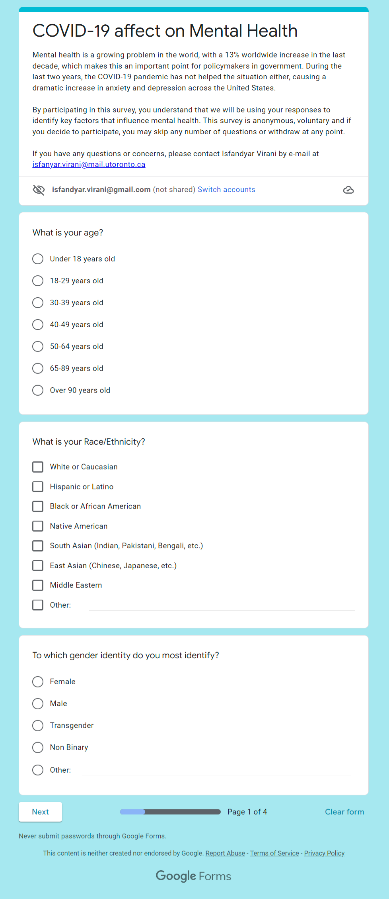
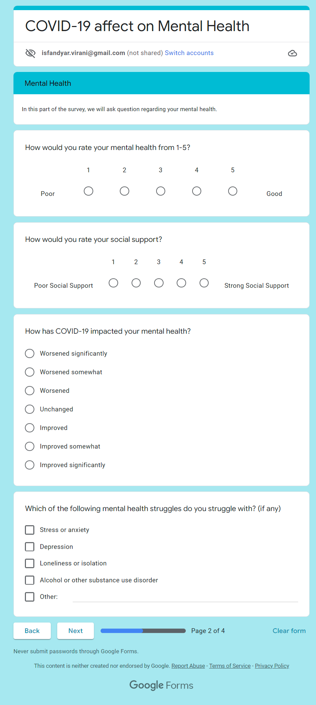
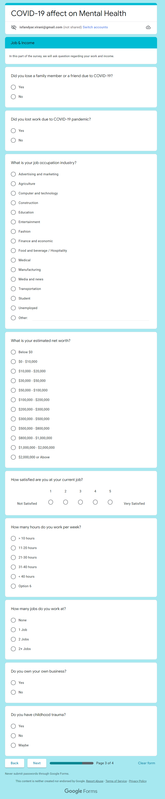
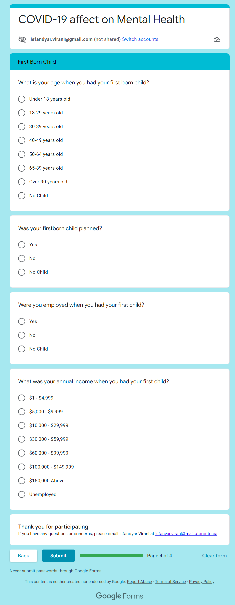

```{r setup, include=FALSE}
knitr::opts_chunk$set(echo = TRUE)
####Workplace Setup####
library(tidyverse)
library(ggplot2)
library(dplyr)
library(haven)
raw_data <- haven::read_dta("../../inputs/data/2021_stata/gss2021.dta")
gss2021 <- raw_data
```

# Introduction

Mental health is a growing problem in the world, with a 13% worldwide increase in the last decade [@worldhealthorganization], which makes this an important point for policymakers in government. During the last two years, the COVID-19 pandemic has not helped the situation either, causing a dramatic increase in anxiety and depression across the United States [@mentalhealthamerica]. 

In this report, we monitor the mental health status of adults (over 18) in the United States, through the COVID-19 pandemic. We observe various groups (of sex, sexual orientation, social and income class) and how they are affected by mental health. This report provides an understanding of extreme cases such as the pandemic, and via collecting as much data as possible, a solution could be made to combat this problem. The effect of the pandemic on the survey itself is also noticeable, with the dramatic decrease in response rate (over 50% before the pandemic to 17.4% for GSS 2021) due to the shift to the web-based system. This can be easily rectified in the future (with the lack of COVID-19), but not much can be done in an extreme case such as the pandemic. 

Trends were noticed in all segregations, with younger and poorer (by income) respondents showing significantly worse mental health. Men were also observed to have poorer mental health. A comparison to respondents’ physical health was also made, with a notable number of respondents being physically healthy but mentally unhealthy.  Members of the LGBTQ+ community also show significantly poorer mental health than those of the heterosexual community. Finally, the social class was also assessed, based on self-identification; which yielded a similar trend to the income class (poorer had more mentally unhealthy respondents), except for the upper-most class; which showed a dramatic increase in poor mental health. These trends are crucial for the government, explicitly showcasing who needs the most help. With the help of policies, one could decrease the poor mental health rate in many of these classes, via analyzing which section of the class needs it most.


# Data

To get better insights on what factors affect Mental health for different parts of the population, we utilized the 2021 US General Social Survey [@norc] from NORC at the University of Chicago [@norc-at-the-university-of-chicago]. The raw dataset is a Stata file and was imported in R using the package Haven [@haven]. It includes data from 568 Survey Questions for 4032 Survey Participants. Using the R [@citeR] package tidyverse [@citetidyverse] and dplyr [@dplyr], we were able to clean and perform exploratory data analysis on the dataset to get insights into the data. Further, we used R package ggplot2 [@citeggplot2] to visualize the data for this paper. 

The survey of interest in this report is the General Social Survey [@norc], one that monitors pubic opinion and behavior in the United States. It has been conducted since 1972 by the NORC at the University of Chicago and funded by the National Science Foundation(NSF); aiming to minimize all changes via retaining similar sampling and questioning approaches.
In each round, the GSS contains a set of repeating modules and a section of topical modules that is subject to change in every round and each participant will be given a subset of repeating modules and topical modules (it may not contain all modules).

## Sample


In this survey, the sample of focus were adults, 18 years of age or older, residing in a noninstitutional (privately owned) home in the United States. Due to the recent pandemic, and the implications on in-person activities; the materials were mailed to people showing them a web link as an invitation. The addresses were provided from the NORC National Sampling Frame as well as the United States Postal Service (USPS) Computerized Delivery Sequence File (CDS). A phone option was also provided, but respondents were pushed to the web survey first. With a response rate of 17.4%, a total of 4,032 surveys were completed; from December 1, 2020, to May 3, 2021. 88.3% of those respondents completed the survey via the web, and 11.7% completed it via the phone.

To choose the respondent out of the houses the mail were being sent, the ‘last birthday method’ was used; selecting the adult with the most recent birthday to when the mail was sent out. Prior to the pandemic, this process was far more rigorous, with an interviewer physically with the respondent, assisting them along the way. The selection process was also more rigorous, with the interviewer making the selection after all adults had filled in an introductory form. The lack of an interviewer made the process \textit{easier} (as in, less fieldwork), but less effective (due to lack of incentive by an interviewer, fewer individuals responded). This was a tradeoff in the sampling approach that must be noted, in comparison to previous years (before the pandemic).

Weights had to be carefully placed to account for various factors; such as population totals, the density of surveyed addresses nearby as well as non-response. Note, the difficulty of the weighting system is that it must account for new data, as well as be similar to the years prior as to not skew the results. 

## Qualities 

The GSS has further made changes to the survey response options as a result of the shift from in-person interviews to web and phone-based interviews. Originally the survey contains “volunteered responses” that are not displayed to the responders and is used by the interviewer. An example would be the option “about right” in response to the question “In general, do you think the courts in this area deal too harshly or not harshly enough with criminals?” ([@norc]). However, in this year's survey, the interviewers are unable to add these volunteered responses due to the lack of interaction on the web and phone-based interviews. Therefore, the GSS adopted a new structure for these volunteered responses on the web mode by creating two different versions of forms with one containing the volunteered responses as an option and the other without. Thus, any changes in the public opinion seen in the 2021 GSS data could be due to either actual changes in public opinion or the result of this newly adopted methodology and should be closely monitored and considered in analysis on the survey.

Changes in the responses “Don’t Know” and “No Answer” have also been made in the 2021 GSS survey. Traditionally, these options would not be shown to the responders, and it is only recorded if the responder does not wish to answer. On the web mode, however, responders can only skip the question and the option of “No Answer” was removed. The option of “Don’t Know” was also removed from attitudinal questions, which are questions regarding the responder’s point of view,  and is always displayed in light-gray, which is different from standard responses, as an option for factual questions, which are questions regarding facts of the responder. Implementing these changes exposes the survey to more “No Answers” and “Don’t Know” responses, which could lead to loss of information. However, the GSS codebook has stated that a finding shows no significant increase in respondents choosing the options “No Answer” and “Don’t Know,” but they also encourage users to conduct further investigation seeing as this finding is still preliminary.


## Bias

There are various sources of bias in this survey, most of which stem from the Covid-19 pandemic. Firstly, the method of data collection itself. Before the pandemic, the survey would be conducted in person; and a random member of the household would be chosen. This had a high response rate of well above 50%. The pandemic forced these surveys to be web-based, drastically decreasing the response rate to 17%. This causes a far higher non-response bias than previous GSS surveys. To account for this, a weighting system was applied to the data to set the samples as close to the US Census Bureau estimates as possible.

Due to the collection of the survey completely shifting from in-person to web-based, measurement bias was undeniably present. The primary factor of difference is the lack of interviewer assistance (explaining the question further, etc.). The questions were also slightly altered to account for the shift in the interface, which added to errors in the measurement due to variability from past surveys.

The past method of respondent selection would be a lot more comprehensive, where each household member who was an adult (over 18) would fill in some basic data, then a random one would be chosen to complete the full interview. The pandemic caused this method to shift to selecting the adult with the most recent birthday, which changes the ‘randomness’ in the data, as compared to years prior. The major issue this brings up is known as coverage bias, since it is possible that people chosen are no longer in the same house or could be abroad, as well as a possibility of adult children residing with the parents, leading to either a non-response or a not correctly measured sample.

Finally, due to a sample of the population being taken and surveyed, sampling bias with how the groups were sampled and weighted will always be present. Since different parts of the sample might be responding each year (with a similar sample taken each year, like in this survey), this must be taken into consideration. To account for this, significance tests are conducted with trend differences to assure no extreme changes. 

Due to the surveys being completely anonymous, with the respondent having an option to skip each question, the ethicality of the survey was handled well.


## Variables of Interest

This survey contains a total of 565 variables and 4032 observations. However, due to the design of the survey and the impact of the COVID-19 pandemic, each participant may not receive the same survey questions thus leaving some responses empty. 

This report focuses on a subset of variables that will be used to analyze the trends and correlations of mental health with each different social aspect. Furthermore, many of these variables have been pre-processed and transformed into commonly seen categories to generalize the results. 

Both mental health variables and physical health variables are separated into two categories, “Good” and “Not Good” with a cut-off point at the center of the range of original values. Age is categorized into groups according to the GSS codebook, separated for every 10 years of age except for ages 18 to 29 and 65 above. The participants’ age when they had their firstborn child is also categorized in the same fashion as age groups. Finally, each participants income class is categorized for each \$20,000 with the exception of under \$10,000, between \$10,000 and \$20,000, and above $90,000. These categorizations will facilitate the results by yielding a clearer distinction between each group and provide a generalization of the results.

Other variables, such as sex, sexual orientation, and social class, the report retains its original labels as it already consists of a set of well-distinguished categories for analysis. For the participants' sex, it is separated as “Male” and “Female” with a small percentage (under 2%) of “No answer” and “Not Applicable.” Participants’ sexual orientation is categorized as “Gay, Lesbian, or Homosexual”, “Bisexual”, and “Heterosexual or Straight”. Finally, social classes are categorized as “Lower”, “Working”, “Lower Middle”,  “Middle”, “Upper Middle”,  and “Upper” class, and these classes are identified by the participants themselves with their assessments.


# Results

Using several responses through the survey, we are able to observe the results visually using ggplot [@citeggplot2]; aiding in the understanding of the results. 

## Mental Health - Male Vs Female

We first take a broad look at the two genders and observe the effect on their mental health. 


```{r fig1, warning=FALSE, fig.cap="Mental Health - Male Vs Female", message = FALSE, echo=FALSE, fig.width=5, fig.height=5}
labels <- c("Female", "Male")
gss2021$sex_group <- cut(gss2021$sex, 2, labels = labels)
#Recoding mental health
# Changed good or better to 'Good'
# Change poor and fair to 'Not Good'
gss2021 <- gss2021 %>%
  mutate(`Mental Health` = case_when(
    hlthmntl == 1 ~ 'Good',
    hlthmntl == 2 ~ 'Good',
    hlthmntl == 3 ~ 'Good',
    hlthmntl == 4 ~ 'Not Good',
    hlthmntl == 5 ~ 'Not Good',
  ))
#=============================================================================
# Percent Graph - Mental health - Male Vs Female
gss2021 %>% filter(!is.na(`Mental Health`), !is.na(sex_group)) %>% ggplot(aes(x= `Mental Health`,  group=sex_group)) +
  geom_bar(aes(y = ..prop.., fill = factor(..x..)), stat="count") +
  geom_text(aes( label = scales::percent(..prop..),
                 y= ..prop.. ), stat= "count", vjust = -.5) +
  labs(y = "Percent", x = 'Mental Health', title = 'Mental Health: Male vs. Female') +
  facet_grid(~sex_group) +
  scale_y_continuous(labels = scales::percent) + theme(legend.position="none") + scale_fill_brewer(palette = "Spectral")
```

(Figure \@ref(fig:fig1)) – Mental health (Male vs Female)) shows that 18.3% of the male respondents reported having ‘Not Good’ mental health and 81.7% reported ‘Good’ mental health compared to 13.8% of the female respondents reported having ‘Not Good’ mental health and 86.2% reported ‘Good’ mental health.

An unequal percentage in both populations conveys an important message; that males are more in need of assistance with their mental health than females. 

We now observe the relationship between mental and physical health. An obvious implication would be that poor mental health implies poor physical health and vice-versa.


## Mental Health – Physical Health


```{r fig2, warning=FALSE, fig.cap="Mental Health – Physical Health", message = FALSE, echo=FALSE, fig.width=5, fig.height=5}
#Recoding physical health
gss2021 <- gss2021 %>%
  mutate(`Physical Health` = case_when(
    hlthphys == 1 ~ 'Good',
    hlthphys == 2 ~ 'Good',
    hlthphys == 3 ~ 'Good',
    hlthphys == 4 ~ 'Not Good',
    hlthphys == 5 ~ 'Not Good',
  ))
#=============================================================================
# Percent Graph Physical health - Good Mental health vs Bad Mental Health
gss2021 %>% filter(!is.na(`Mental Health`), !is.na(sex_group), !is.na(`Physical Health`)) %>%
  ggplot(aes(x= `Physical Health`,  group= `Mental Health`)) +
  geom_bar(aes(y = ..prop.., fill = factor(..x..)), stat="count") +
  geom_text(aes( label = scales::percent(..prop..),
                 y= ..prop.. ), stat= "count", vjust = -.5) +
  labs(y = "Percent", fill="Physical Health", x = 'Physical Health', title = "Mental Health vs. Physical Health" ) +
  facet_grid(~`Mental Health` , labeller = label_both) +
  scale_y_continuous(labels = scales::percent) + theme(legend.position="none") + scale_fill_brewer(palette = "Spectral")
```


In (Figure \@ref(fig:fig2)), we can see that for people who reported ‘Not Good’ mental health, 56% reported having ‘Not Good’ physical health, and 44% reported ‘Good’ physical health. While, for the people who reported ‘Good’ mental health, 13% reported ‘Not Good’ physical health, and 87% reported ‘Good’ physical health. 

Here we observe slight inconsistencies with mental and physical health; proving to be quite different from one another. This graph implies people’s physical health (from their perspective) is a lot stronger than their mental health; a significant portion of the respondents who selected “Not Good” for their mental health also selected “Good” for their physical health (44%). We aim to deduce a pattern in this relationship by now comparing male and female responses to physical health, with a “Not Good” mental health response.


```{r fig3, warning=FALSE, fig.cap="Physical Health Comparison of Male Vs. Female with Poor Mental Health", message = FALSE, echo=FALSE, fig.width=7, fig.height=6}
# Percent Graph - Poor Mental health = Physical health within Sex_Group comparison
gss2021 %>% filter(!is.na(`Mental Health`), !is.na(sex_group), !is.na(`Physical Health`), `Mental Health` =='Not Good') %>%
  ggplot(aes(x= `Physical Health`,  group=sex_group)) +
  geom_bar(aes(y = ..prop.., fill = factor(..x..)), stat="count") +
  geom_text(aes( label = scales::percent(..prop..),
                 y= ..prop.. ), stat= "count", vjust = -.5) +
  labs(y = "Percent", x="Physical Health", title = "Physical Health Comparison of Male Vs. Female with Poor Mental Health") +
  facet_grid(~sex_group) +
  scale_y_continuous(labels = scales::percent) + theme(legend.position="none") + scale_fill_brewer(palette = "Spectral")
```

In (Figure \@ref(fig:fig3)), we found that for participants whose mental health is ‘Not Good’, both Male and Female participants have a similar distribution of physical health at 54.5% Female and 56.4% Male reporting ‘Not Good’ physical health and 45.5% of Female  43.6% of Male reporting ‘Good’ physical health while having poor mental health. This displays a pattern, that males and females have nearly identical percentages for their physical health; given poor mental health.
Having understood the gender distribution, we now aim to understand the effects of mental health given the respondent's age.


## Mental Health – Age Groups


```{r fig4, warning=FALSE, fig.cap="Mental Health – Age Groups", message = FALSE, echo=FALSE, fig.width=7, fig.height=5}
# Recording Age Group
gss2021 <- gss2021 %>%
  mutate(`Age Group` = case_when(
    age >= 18 & age <= 29 ~ '18-29',
    age >= 30 & age <=39~ '30-39',
    age >= 40 & age <=49~ '40-49',
    age >= 50 & age <=64~ '50-64',
    age >= 65 & age <=89~ '65-89'
  ))
#=============================================================================
# Percent Graph - Mental health (Age Group Analysis)
gss2021 %>% filter(!is.na(`Mental Health`),!is.na(`Age Group`)) %>%
  ggplot(aes(x= `Mental Health`,  group=`Age Group`)) +
  geom_bar(aes(y = ..prop.., fill = factor(..x..)), stat="count") +
  geom_text(aes( label = scales::percent(..prop..),
                 y= ..prop.. ), stat= "count", vjust = -.5) +
  labs(y = "Percent", x="Mental Health", title = "Mental Health: Comparison of Different Age Groups") +
  facet_grid(~`Age Group`, labeller = label_both) +
  scale_y_continuous(labels = scales::percent) + theme(legend.position="none") + scale_fill_brewer(palette = "Spectral")
```

In (Figure \@ref(fig:fig4)), we can see that the Age Group of 18-29 has the highest ‘Not Good’ mental health at 34.5% followed by Ages 30-39 with 23.5%, 16.4% for Age Group 40-49, 13.4% for Age Group 50-64, and 9.1% for Age group 65-89. 

Here, we can observe a very interesting pattern, that quality of mental health is highly dependent on one’s age; with the youngest respondents reporting the poorest mental health.


## Mental Health - Sexual Orientation


```{r fig5, warning=FALSE, fig.cap="Mental Health – Sexual Orientation", message = FALSE, echo=FALSE, fig.width=5, fig.height=5}
# Recoding Sexual orientation
gss2021 <- gss2021 %>%
  mutate(sexual_orientation = case_when(
    sexornt == 1 ~ 'LGBTQ+',
    sexornt == 2 ~ 'LGBTQ+',
    sexornt == 3 ~ 'Heterosexual'
  ))
#=============================================================================
# Percent Graph - Mental health (Sexual Orientation Analysis)
gss2021 %>% filter(!is.na(`Mental Health`), !is.na(sexual_orientation)) %>%
  ggplot(aes(x= `Mental Health`,  group=sexual_orientation)) +
  geom_bar(aes(y = ..prop.., fill = factor(..x..)), stat="count") +
  geom_text(aes( label = scales::percent(..prop..),
                 y= ..prop.. ), stat= "count", vjust = -.5) +
  labs(y = "Percent", x="Mental Health", title = "Mental Health: Heterosexual vs. LGBTQ+") +
  facet_grid(~sexual_orientation) +
  scale_y_continuous(labels = scales::percent) + theme(legend.position="none") + scale_fill_brewer(palette = "Spectral")
```

In (Figure \@ref(fig:fig5)), we can see that 35% of LGBTQ+ reported their mental health as being Not Good (I.e, Poor or Fair) compared to 14% of Heterosexual. LGBTQ+ population experience a higher rate of poor mental health compared to the Heterosexual population. 


## Mental Health: Social Class


```{r fig6, warning=FALSE, fig.cap="Mental Health – Social Class", message = FALSE, echo=FALSE, fig.width=9, fig.height=5}
gss2021 <- gss2021 %>%
  mutate(`Social Class` = case_when(
    class1 == 1 ~ "lower",
    class1 == 2 ~ "working",
    class1 == 3 ~ "lower middle",
    class1 == 4 ~ "middle",
    class1 == 5 ~ "upper middle",
    class1 == 6 ~ "upper"))
#=============================================================================
# 'Mental Health: Comparison of Different Social Classes'
gss2021 %>% filter(!is.na(`Mental Health`), !is.na(`Social Class`)) %>% ggplot(aes(x= `Mental Health`,  group= `Social Class`))+
  geom_bar(aes(y = ..prop.., fill = factor(..x..)), stat="count") +
  geom_text(aes( label = scales::percent(..prop..),
                 y= ..prop.. ), stat= "count", vjust = -.5) +
  labs(y = "Percent", fill="mntl_poor", title = 'Mental Health: Comparison of Different Social Classes') +
  facet_grid(~factor(`Social Class`, levels = c('lower', 'working','lower middle', 'middle', 'upper middle', 'upper'))) +
  scale_y_continuous(labels = scales::percent) + theme(legend.position="none") + scale_fill_brewer(palette = "Spectral")
```

(Figure \@ref(fig:fig6)) shows a bar graph of the mental health rating for each of the social classes. These social classes are self-identified by the responder to see where they see fit in the 6 different social classes.  44.2% of the lower social class, 21.3% of the working class, 20% of the lower middle class, 12.6% of the middle class, 7.5% of the upper-middle class, and 27.3% of the upper-class respondents responded with poor mental health. 


## Mental Health: Total Family Income


```{r fig7, warning=FALSE, fig.cap="Mental Health – Total Family Income", message = FALSE, echo=FALSE, fig.width=8, fig.height=5}
# Recoding Family Income
gss2021 <- gss2021 %>% 
  mutate(Income = case_when(
    income16 <= 8 ~ "< $10,000",
    income16 <= 12 ~ "$10,000 - $20,000",
    income16 <= 17 ~ "$20,000 - $40,000",
    income16 <= 19 ~ "$40,000 - $60,000",
    income16 <= 21 ~ "$60,000 - $90,000",
    income16 > 21 ~ "> $90,000"))
#=============================================================================
# 'Mental Health: Comparison by Total Family Income'
gss2021 %>% filter(!is.na(`Mental Health`), !is.na(Income)) %>%  ggplot(aes(x= `Mental Health`,  group=Income))+
  geom_bar(aes(y = ..prop.., fill = factor(..x..)), stat="count") +
  geom_text(aes( label = scales::percent(..prop..),
                 y= ..prop.. ), stat= "count", vjust = -.5) +
  labs(y = "Percent" , title = 'Mental Health: Comparison by Total Family Income') +
  facet_grid(~factor(Income, levels = c('< $10,000', "$10,000 - $20,000", "$20,000 - $40,000", "$40,000 - $60,000", "$60,000 - $90,000", "> $90,000"))) +
  scale_y_continuous(labels = scales::percent) + theme(legend.position="none") + scale_fill_brewer(palette = "Spectral")
```

(Figure \@ref(fig:fig7)) shows a bar graph of the mental health comparison for different family income groups. 32.3% in the lowest income bracket (< \$10,000), 29.5%  in the lower-income (\$10,000 - \$20,000), 23.8% in lower middle income (\$20,000 - \$40,000), 18.3% in the middle income (\$40,000 - \$60,000), 13.4% in the upper middle income (\$60,000 - \$90,000), and 7.7% in the upper income (> \$90,000)  responded with ‘Not Good’ mental health. There is a clear trend in lower income family income having worse mental health compared to higher income groups. 

## Mental Health: Age When First Child was Born


```{r fig8, warning=FALSE, fig.cap="Mental Health – Age When First Child was Born", message = FALSE, echo=FALSE, fig.width=8, fig.height=5}
# Recoding Age when first kid is born
gss2021 <- gss2021 %>%
  mutate(`Kid Born` = case_when(
    agekdbrn < 18 ~ '< 18',
    agekdbrn >= 18 & agekdbrn <= 29 ~ '18-29',
    agekdbrn >= 30 & agekdbrn <=39~ '30-39',
    agekdbrn >= 40 & agekdbrn <=49~ '40-49',
    agekdbrn >= 50 & agekdbrn <=64~ '50-64',
    agekdbrn >= 65 & agekdbrn <=89~ '65-89'
  ))
#=============================================================================
#  "Mental Health: Comparison by age when first child was born"
gss2021 %>% filter(!is.na(`Mental Health`), !is.na(`Kid Born`))  %>% ggplot(aes(x= `Mental Health`,  group=`Kid Born`))+
  geom_bar(aes(y = ..prop.., fill = factor(..x..)), stat="count") +
  geom_text(aes( label = scales::percent(..prop..),
                 y= ..prop.. ), stat= "count", vjust = -.5) +
  labs(y = "Percent", title = "Mental Health: Comparison by Age When First Child was Born") +
  facet_grid(~`Kid Born`) +
  scale_y_continuous(labels = scales::percent) + theme(legend.position="none") + scale_fill_brewer(palette = "Spectral")
```

(Figure \@ref(fig:fig8)) shows a bar graph of the respondent’s age when they had their firstborn child. 18.9% of age younger than 18, 14.4% of age between 18 and 29, 10.2% of age between 30-39, 7% of age between 40-49, and 0% of age 50 and above responded with poor mental health. 


# Discussion

Due to the COVID-19 pandemic, there has been a rise in mental health [@katekelland_2020]. With the rise in COVID-19 cases and social distancing being enforced by the governments, there is an increase in anxiety and depression due to isolation, job loss, and fear of infection [@world-health-organization]. Looking into our data analysis we find some key insights that can help policymakers to take appropriate actions to reduce mental health suffering which can reduce long-term social and economical costs for society.

## Male Vs Female

Although the difference between ‘Not Good’ mental health between female and male participants isn’t huge (less than 5%) in (Figure \@ref(fig:fig1)), our findings are a contradiction to studies such as [@Otten2021] and [@moyser_2020] that suggests that females are more likely than males to report worse mental health, especially since physical distancing began due to the pandemic. 


## Physical Health

In (Figure \@ref(fig:fig2)), we see those survey participants who reported their mental health as Poor or Fair have significantly worse physical health compared to participants who have good mental health. This finding can also be seen in different studies such as [@Vaillant1979] and is mentioned [@mental-health-foundation_2022] & [@cmha-ontario] as physical health and mental health are inextricably related. Physical health can be managed by exercising, eating well, and avoiding smoking & drinking. 


## Age Groups

The trend of (Figure \@ref(fig:fig4)) shows that as the Age Group increases, the reporting of poor mental health decreases. This finding is also supported by [@national-institute-of-mental-health] which also confirms that younger age groups have increased reported poor mental health. Poor mental health is also strongly related to other health and development concerns in young people, notably lower educational achievements, substance abuse, violence, and poor reproductive and sexual health [@Patel2007]. 


## Sexual Orientation

LGBTQ+ individuals have poor mental health compared to heterosexual individuals [@McDonald2018]. This is due to many factors such as lack of social support which has an association with higher levels of depression, anxiety, and low self-esteem [@McDonald2018].


## Income and Social Class

People with lower income will most likely identify themselves as a lower social class as these two factors are closely related [@parker_2020]. And from (Figure \@ref(fig:fig6)) and (Figure \@ref(fig:fig7)), it is observed that people with lower income and lower social class have a higher percentage of people reporting poor mental health. This discovery aligned with an article by the Canadian Mental Health Association (CMHA) on Poverty and Mental Illness [@cmha-ontario-2]. Furthermore, With the added mental stress on lower classes, treatments also vary from class, with the higher classes having access to the highest quality psychiatrist, with the lower classes always receiving the lowest quality treatment [@SocialClass-MentalIllness]. 

However, there is a drastic increase in poor mental health percentage for the upper class, which is not seen in the income graph. After investigation, the participants who reported poor mental health and an upper social class consisted of roughly 45% being at the age of 50 or older. According to the World Health Organization(WHO), it is estimated that over 20% of adults over the age of 60 suffer from some mental or neurological disorders [@world-health-organization-2]. Although this may sound contradicting to the Age trend that was mentioned, there are only 10 people who are age 50 and above and identifies as upper class, thus this is a relatively small portion of the age group. Older respondents may also respond with a lower income and social class due to retirement. 

Furthermore, while there are 9.2% of the participants responded with a salary over $170,000, only 0.5% identified as upper class and 5.6% identified as upper-middle-class, thus respondents with salaries that fit in the upper class may be reporting to a lower social class or skipping the question or responding with “Don’t Know” as described in the Quality of Data Section [Qualities][Qualities]. These factors may explain the increase in poor mental health in participants in the upper social class with poor mental health.


## Firstborn Child Age

(Figure \@ref(fig:fig8)) shows that the younger the respondents are when they had their firstborn child, the more likely they will experience poor mental health as the percentage steadily decreases as age increases. Several reasons may explain this phenomenon. To raise a child, certain financial needs will arise such as food costs, equipment, and medical attention that are specific to babies [@lino_2020], and more time would be needed to be taking care of the child [@miller_2018]. And as younger workers are more likely to have less experience in the work field, most young workers take on entry-level occupations which often have lower compensation [@hill_2020]. Thus, the respondent may experience more financial stress as well as work stress due to the additional financial costs and time costs. 

And from the income graph in (Figure \@ref(fig:fig7)) people with lower income are also more likely to experience poor mental health, so with these factors altogether, it is expected that the percentage of poor mental health is higher with people having their firstborn at a younger age. However, only 4 respondents, which makes up nearly 0% of the respondents, had a response of ages 50 and above, thus this age group may not be the best representation of the mental health for people who had their firstborn child at ages 50 and above.


## Weaknesses and next steps

Covid-19 undoubtedly had a significant impact on the 2021 GSS Survey. With the cancellation of in-person interviews and the shift onto web and phone mode, this year’s GSS interviewers were unable to interact with the respondents; skipping questions, and volunteer responses were allowed. This may introduce within the responses without any unbiased medium, such as the interviewer to assess. Furthermore, as mentioned in the #Bias Section, the randomness of the survey has shifted and the response rate drastically decreased due to the impact of the pandemic. Although weighting has been introduced in an attempt to alleviate the impacts, these are still factors to consider. 

Finally, we must consider how the mental health rating is provided by the respondent. In this survey, the response is based on their \textit{self}-diagnosis, and not a medical professional. It is very common today for people to \textit{believe} they have poor mental health [@upshaw_2020], which might lead to a bias in the results. This should be noted, with future surveys potentially requesting for a doctor’s diagnosis; to more accurately represent the mental health situation in the United States.


\newpage

\appendix

# Appendix {-}


# Supplementary survey

Our supplementary survey is available here: [https://tinyurl.com/supplemental-MentalHealth](https://tinyurl.com/supplemental-MentalHealth)

Additionally, you can scan this QR code:
{width=20% height=20%}\

The following images show the screenshots of the online survey form:


```{r echo=FALSE, out.width='100%'}

```

```{r echo=FALSE, out.width='100%'}

```

```{r echo=FALSE, out.width='100%'}

```

```{r echo=FALSE, out.width='100%'}

```


\newpage


# References
